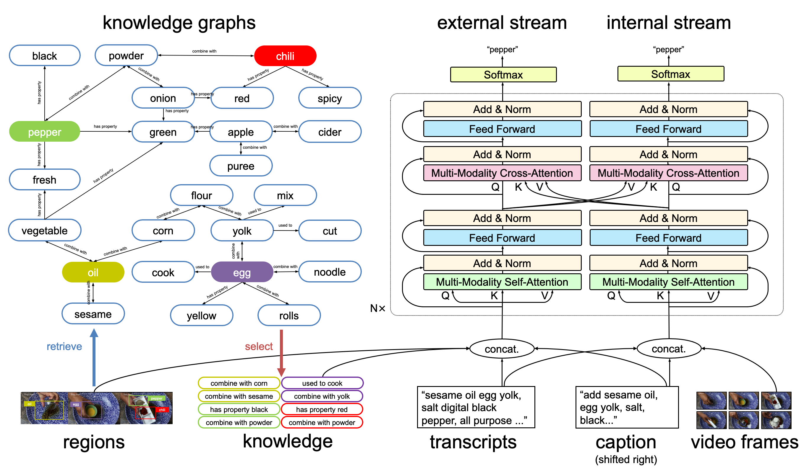

# Text with Knowledge Graph Augmented Transformer for Video Captioning

## Introduction

This repository provides the code and resources associated with our paper titled **Text with Knowledge Graph Augmented Transformer for Video Captioning**, which has been accepted by CVPR 2023. The paper presents a novel approach that leverages knowledge graphs to deal with the the challenge of long-tail words in video captioning tasks.
[paper](https://arxiv.org/abs/2303.12423)

We plan to release the code as open source in mid-June. Stay tuned to our GitHub repository for the latest updates and notifications.

